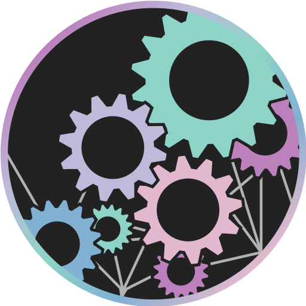

#  Borshevik


Borshevik is an immutable, laptop-first desktop image built on Fedora Atomic and the uBlue ecosystem, designed to be simple to use and ready to go right after installation. It’s delivered as a single, read-only system image with atomic updates and easy rollbacks. It includes stock Fedora GNOME tuned with a small set of GNOME Shell extensions, plus multimedia support, Chrome, Steam, and a curated Flatpak set — so you can install it and get straight to work, even if you’re new to Linux.

## 🎯 Who is this image for?

Borshevik is built as a practical daily driver with a clear target audience:

- **Laptop-first (but desktops are supported too):** defaults and UX are tuned primarily for modern laptops, while still working great on desktop machines.
- **Built for daily work:** tuned for everyday productivity and daily use.
- **Also good for gaming:** Steam is included and works out of the box.
- **Predictable and low-maintenance:** the “turn it on and start working” mindset, with consistent behavior and easy recovery.

## 🌸 Core Image

Borshevik is built as a single, read-only system image on top of Fedora Atomic with help from the uBlue ecosystem. Updates land as complete images: you install the new one, and if something breaks you can simply boot back into the previous version. Common multimedia codecs are included so video and audio work right after install. There is also a separate NVIDIA build with the proprietary driver preinstalled.

## 🌐 Chrome

Chrome comes preinstalled using the official RPM from Google. It runs natively on Wayland and supports smooth touchpad gestures out of the box, with no extra setup required.

## 🎮 Steam

Steam comes preinstalled, so you can play right away without extra setup. Many games work out of the box, and other game stores are also available to install.

## 📦 Application Set

Borshevik includes Borshevik App Manager — a simple tool that helps you quickly install a recommended set of Flatpak apps for different use cases (work, media, development, communication, and more). It’s especially useful if you’re new to Linux and want a solid “starter pack” without hunting for apps one by one.

It also supports bulk installation from a custom list: you can paste (or generate on another machine) a list of Flathub app IDs, and the manager will install them all in one go — an easy way to replicate your setup across devices.

## 🧩 GNOME Extensions

Borshevik ships with a set of GNOME Shell extensions preinstalled during the image build. The full list and any patches are documented in [list.json](build_files/scripts/gs-extensions/list.json), so you can always see what’s included.

These extensions add small quality-of-life improvements like clipboard history, a color picker, picture-in-picture, workspace tweaks, and a few visual enhancements.

## 🛡️ Privacy & Telemetry

Borshevik does not add extra telemetry or tracking on top of what Fedora already ships. There are no required online accounts, and the system image is fully documented and reproducible via the public build files in this repository.

## 👷 Rebasing from another uBlue

If you’re already on another Fedora Atomic or uBlue image, you can switch to Borshevik with a single rebase command:

```bash
sudo rpm-ostree rebase ostree-image-signed:docker://ghcr.io/komorebinator/borshevik:stable
```

or, for NVIDIA GPUs:

```bash
sudo rpm-ostree rebase ostree-image-signed:docker://ghcr.io/komorebinator/borshevik-nvidia:stable
```

After the rebase, reboot into the new image and you’re done.

## 💿 New installation

[](https://borshevik.org/iso/borshevik-stable.iso)    [](https://borshevik.org/iso/borshevik-nvidia-stable.iso)

You may also need **Fedora Media Writer** to write the ISO to a USB drive:
- [macOS / Windows](https://github.com/FedoraQt/MediaWriter/releases/latest)
- [Linux (Flathub)](https://flathub.org/apps/org.fedoraproject.MediaWriter)