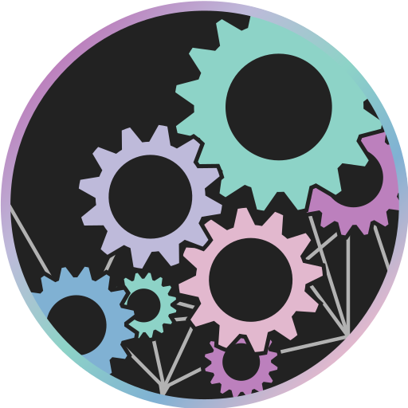

#  Borshevik


Borshevik is an immutable, laptop-first desktop image built on Fedora Atomic and the uBlue ecosystem, designed to be simple to use and ready to go right after installation. It’s delivered as a single, read-only system image with atomic updates and easy rollbacks. It includes stock Fedora GNOME tuned with a small set of GNOME Shell extensions, plus multimedia support, Chrome, Steam, Android apps from Google Play, a built-in VPN client with VLESS and other censorship-resistant protocols, and a curated Flatpak set — so you can install it and get straight to work, even if you’re new to Linux.

## 🎯 Who is this image for?

Borshevik is built as a practical daily driver with a clear target audience:

- **Laptop-first (but desktops are supported too):** defaults and UX are tuned primarily for modern laptops, while still working great on desktop machines.
- **Built for daily work:** tuned for everyday productivity and daily use.
- **Also good for gaming:** Steam is included and works out of the box.
- **Predictable and low-maintenance:** the “turn it on and start working” mindset, with consistent behavior and easy recovery.

## 🌸 Core Image

Borshevik is built as a single, read-only system image on top of Fedora Atomic with help from the uBlue ecosystem. Updates land as complete images: you install the new one, and if something breaks you can simply boot back into the previous version. Common multimedia codecs are included so video and audio work right after install. There is also a separate NVIDIA build with the proprietary driver preinstalled.

## 🌐 Chrome

Chrome comes preinstalled using the official RPM from Google. It runs natively on Wayland and supports smooth touchpad gestures out of the box, with no extra setup required.

## 🎮 Steam

Steam comes preinstalled, so you can play right away without extra setup. Many games work out of the box, and other game stores are also available to install.

## 🤖 Android Apps

Borshevik can run Android apps in windows of their own, alongside your desktop apps. Android support is optional and installed on demand — from the Android tab of the Image Manager, or by checking it in the App Manager — and downloads about 1.4 GB. It runs on [Waydroid](https://waydro.id) with Google Play services, so apps install from Google Play and keep themselves up to date. Google asks for the device to be registered with your account once before Google Play signs in; the Image Manager shows the device ID and links to the registration page. Game controllers work too.

## 📦 Application Set

Borshevik includes Borshevik App Manager, which opens on first login. Its **New installation** tab offers a recommended set of Flatpak apps grouped by use case (work, media, development, communication, and more) and additional modules, such as support for Android apps — a solid starter pack without hunting for apps one by one.

Its **From another PC** tab carries your setup over from an older computer: copy its configuration there — with the App Manager on Borshevik, or with a short script on any other Linux — and paste it here to install the same apps and modules in one go. Pairing both computers with GSConnect gives them a shared clipboard to carry it.

## 🔒 VPN

[Hiddify](https://github.com/hiddify/hiddify-app) comes preinstalled — a native desktop VPN client powered by [sing-box](https://github.com/SagerNet/sing-box). It runs as a tray application and supports all major modern proxy protocols:

| Protocol | Notes |
|----------|-------|
| VLESS + Reality | Recommended — censorship-resistant, mimics HTTPS |
| VLESS + TLS | Standard VLESS over TLS |
| VMess | Classic v2ray protocol |
| Hysteria / Hysteria2 | UDP-based, fast on lossy connections |
| TUIC | QUIC-based protocol |
| WireGuard | Including Cloudflare WARP |
| SSH | SSH tunneling |

Supports subscription formats: Sing-box, V2ray, Clash, Clash Meta. Import via a share link or subscription URL directly in the app.

## 🧩 GNOME Extensions

Borshevik ships with a set of GNOME Shell extensions preinstalled during the image build. The full list and any patches are documented in [list.json](build_files/scripts/gs-extensions/list.json), so you can always see what’s included.

These extensions add small quality-of-life improvements like clipboard history, a color picker, picture-in-picture, workspace tweaks, and a few visual enhancements.

## 🛡️ Privacy & Telemetry

Borshevik does not add extra telemetry or tracking on top of what Fedora already ships. There are no required online accounts, and the system image is fully documented and reproducible via the public build files in this repository.

## 👷 Rebasing from another uBlue

If you’re already on another Fedora Atomic or uBlue image, you can switch to Borshevik with a single rebase command:

```bash
sudo rpm-ostree rebase ostree-image-signed:docker://ghcr.io/komorebinator/borshevik:stable
```

or, for NVIDIA GPUs:

```bash
sudo rpm-ostree rebase ostree-image-signed:docker://ghcr.io/komorebinator/borshevik-nvidia:stable
```

After the rebase, reboot into the new image and you’re done.

## 💿 New installation

[](https://borshevik.org/iso/borshevik-stable.iso)    [](https://borshevik.org/iso/borshevik-nvidia-stable.iso)

You may also need **Fedora Media Writer** to write the ISO to a USB drive:
- [macOS / Windows](https://github.com/FedoraQt/MediaWriter/releases/latest)
- [Linux (Flathub)](https://flathub.org/apps/org.fedoraproject.MediaWriter)