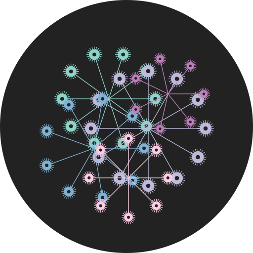

#  Borshevik

[🇬🇧 English](README.md) | [🇷🇺 Русский](README.ru.md)

## 🌸 Основной образ

Borshevik — готовый образ Fedora Atomic, собранный с помощью проекта uBlue. Система пакуется в стандатный OCI образ, и доступна только на чтение. Образы обновляются целиком. Это дает высокую отказоустойчивость, например, если после обновления что-то сломалось, в загрузчике можно выбрать предыдущую версию и продолжить работу. В образ уже встроены популярные мультимедийные кодеки, а для видеокарт NVIDIA есть отдельная сборка с драйвером. Поскольку Borshevik входит в семейство uBlue, переключиться на другие сборки (например, Bazzite) или вернуться обратно можно одной командой `rpm-ostree rebase`, без переустановки.

## 🌐 Google Chrome

Образ содержит последнюю версию Google Chrome из официального RPM-репозитория. Браузер работает на Wayland, поддерживает жесты тачпада и не требует дополнительной настройки.

## 📦 Набор приложений

Фоновая служба устанавливает программы из списка, хранящегося в [flatpaks.txt](build_files/root/usr/share/app-choice-subscription/flatpaks.txt). Удалённые пользователем приложения не возвращаются, а вновь добавленные ставятся автоматически. Обновление списков просходит вместе с обновлением дисторибутива. В список включены GIMP, видеоредактор, LibreOffice, адресная книга и календарь, VLC, OBS Studio, аудиоредактор, Bottles для Windows-приложений, Steam, Telegram, интерфейс для локального запуска ИИ моделей Alpaca.

## 🧩 Расширения GNOME

Расширения GNOME Shell добавляются при сборке образа: большинство клонируется из Git, GSConnect ставится через RPM. Все патчи для совместимости находятся в  [list.json](build_files/scripts/gs-extensions/list.json).

## 🧬 Ядро

Используется стандартное ядро Fedora без изменений. Встроенный сервис автоматически включает параметр `preempt=full` для большей отзывчивости и добавляет рекомендуемые флаги для Wayland и NVIDIA, если такая видеокарта обнаружена.

## ⚙️ GNOME Control Center

Центр настроек GNOME пересобран с патчами, которые добавляют дробное масштабирование и поддержку VRR. Пакет собирается в COPR и входит в образ.

## 🌱 Инструменты разработчика

В систему входит терминал Ghostty; оболочка Zsh доступна как альтернатива; Distrobox позволяет быстро запускать другие Linux-окружения в контейнерах.
